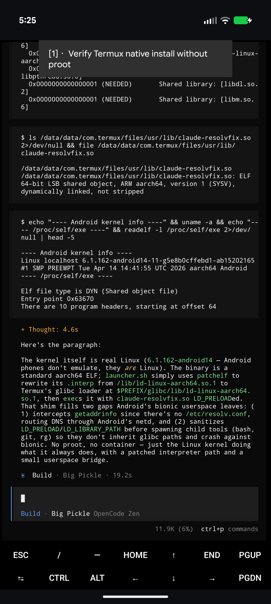

# opencode-termux-native

Run **[OpenCode](https://opencode.ai) natively on Termux** (Android · aarch64) — **no proot, no root.**

OpenCode ships a **glibc-dynamic Bun binary** for `linux-arm64` — the same shape as Claude Code. On Termux it won't run as-is (its interpreter `/lib/ld-linux-aarch64.so.1` doesn't exist, and `/etc/resolv.conf` can't exist). Two small steps fix that.

> Runtime only — no account data. Add providers with `opencode providers`.

## Demo — OpenCode explaining its own install

Asked how it's running, OpenCode inspects its own launcher on-device (Android 17, Pixel 9 Pro XL) and explains the patchelf'd glibc loader + `LD_PRELOAD` resolv shim:



## How it works

| Piece | Role |
|-------|------|
| **Termux glibc repo** (`glibc`, `patchelf-glibc`, `binutils-glibc`) | glibc runtime + loader under `$PREFIX/glibc` |
| **patchelf the interpreter** | OpenCode's binary is `0x10000`-aligned and patchelf-clean (Bun, not Go), so we just repoint its interpreter to Termux's glibc loader — no align-fix, no loader-direct. The launcher re-applies this after a self-update. |
| **`fix_resolv.c` → `claude-resolvfix.so`** | `LD_PRELOAD` shim: redirects `/etc/resolv.conf` reads to `$PREFIX/etc/resolv.conf` (OpenCode's Bun runtime reads it via libc, so the shim catches it) and scrubs `LD_PRELOAD`/`LD_LIBRARY_PATH` so bionic child tools (bash, git, ripgrep) don't choke on glibc. Shared with [claude-code-termux-native](https://github.com/Thr45hx/claude-code-termux-native). |

No root, no proot, no reboot — DNS works immediately (unlike Go/musl agents whose resolvers bypass the shim).

## Requirements
- Termux on **aarch64 / arm64**
- Internet on first run

## Install
```bash
git clone https://github.com/Thr45hx/opencode-termux-native
cd opencode-termux-native
bash install.sh
```
or one-shot:
```bash
curl -fsSL https://raw.githubusercontent.com/Thr45hx/opencode-termux-native/main/install.sh | bash
```
Then:
```bash
opencode providers      # add API keys (free models + HuggingFace built in)
opencode                # TUI
opencode run "..."       # one-shot
```

## Updating

```bash
opencode update          # latest   (alias: opencode upgrade)
opencode update 1.18.18  # a specific version
```

**Do not use OpenCode's own `upgrade` without this launcher.** Upstream's self-updater (the `curl` method) runs the OpenCode **install script**, which on Termux drops a fresh binary in `~/.opencode/bin` carrying the stock `/lib/ld-linux-aarch64.so.1` interpreter — **unrunnable here** — and prepends that dir to `PATH` in `~/.bashrc`, so your next shell silently picks the broken copy.

This launcher **intercepts `update`/`upgrade`** and updates the native way instead: it downloads the glibc `arm64` release tarball straight into `~/agents/opencode/opencode` and re-patchelfs the interpreter — no `~/.opencode`, no `~/.bashrc` edits. `install.sh` also sets `"autoupdate": false` in `~/.config/opencode/opencode.jsonc` so the TUI/background updater can't re-trigger the upstream path.

## Layout
```
~/agents/opencode/
├── opencode      # glibc Bun binary (interpreter patchelf'd)
└── launcher.sh   # ← $PREFIX/bin/opencode symlinks here
$PREFIX/lib/claude-resolvfix.so   # DNS shim (shared)
```

## Files
- `install.sh` — one-command installer (grabs the glibc arm64 build from GitHub releases; sets `autoupdate:false`)
- `launcher.sh` → `$PREFIX/bin/opencode` — re-patchelf + shim + CA bundle + native `update`/`upgrade` interception
- `fix_resolv.c` — the DNS shim source
- `uninstall.sh`

## Uninstall
```bash
bash uninstall.sh
```

## Part of the native-Termux CLI family

One-command **native, no-proot** installers for AI coding CLIs on Termux — same toolkit, one per agent:

- [claude-code-termux-native](https://github.com/Thr45hx/claude-code-termux-native) — Claude Code
- [antigravity-cli-termux-native](https://github.com/Thr45hx/antigravity-cli-termux-native) — Google Antigravity
- [grok-cli-termux-native](https://github.com/Thr45hx/grok-cli-termux-native) — xAI Grok Build
- [opencode-termux-native](https://github.com/Thr45hx/opencode-termux-native) — OpenCode
- [copilot-cli-termux-native](https://github.com/Thr45hx/copilot-cli-termux-native) — GitHub Copilot

## Notes

- **AI-assisted:** built and reverse-engineered with AI help — a daily-driver, not a toy. Provided as-is.
- **Tested on:** Android 17, rooted **Pixel 9 Pro XL** (Tensor G4, aarch64).
- **Root / no-root:** **No root required** — the DNS shim is fully userland (works on any Android).
- **License:** [MIT](./LICENSE).

---

Unofficial — not affiliated with OpenCode. Provided as-is, no warranty.
